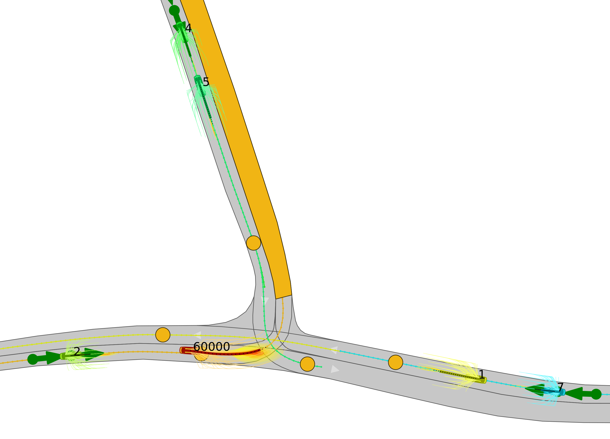

 

# Frenetix Motion Planner

This repository includes a Frenet trajectory planning algorithm in the [CommonRoad](https://commonroad.in.tum.de/) scenario format.
The trajectories are generated according to the sampling-based approach in [1-5] including two different implementations.
The Repo provides a python-based and a C++-accelerated Motion Planner [Frenetix](https://github.com/TUM-AVS/Frenetix/) implementation.

# Occlusion-aware Motion Planning

To try the Occlusion-Ware module, you can find the following readme script here:

 * [frenetix_motion_planner/occlusion_planning/README.md](https://github.com/TUM-AVS/Frenetix-Motion-Planner/blob/master/frenetix_motion_planner/occlusion_planning/README.md).

# Standard Planner Initialization

### Requirements
The software is  developed and tested on recent versions of Linux. We strongly recommend to use [Ubuntu 22.04](https://ubuntu.com/download/desktop) or higher.
For the python installation, we suggest the usage of Virtual Environment with Python 3.10 or Python 3.9
For the development IDE we suggest [PyCharm](http://www.jetbrains.com/pycharm/)

### Installation & Run Code
1. Make sure that the following **dependencies** are installed on your system for the C++ implementation:
   * [Eigen3](https://eigen.tuxfamily.org/dox/) 
     * On Ubuntu: `sudo apt-get install libeigen3-dev`
   * [Boost](https://www.boost.org/)
     * On Ubuntu: `sudo apt-get install libboost-all-dev`
   * [OpenMP](https://www.openmp.org/) 
     * On Ubuntu: `sudo apt-get install libomp-dev`
   * [python3.10-full](https://packages.ubuntu.com/jammy/python3.10-full) 
        * On Ubuntu: `sudo apt-get install python3.10-full` and `sudo apt-get install python3.10-dev`

2. **Clone** this repository & create a new virtual environment `python3.10 -m venv venv`

3. **Install** the package:
    * Source & Install the package via pip: `source venv/bin/activate` & `pip install -r requirements.txt`
    * [Frenetix](https://pypi.org/project/frenetix/) should be installed automatically. If not please write [rainer.trauth@tum.de](mailto:rainer.trauth@tum.de).

4. **Optional**: Download additional Scenarios:
    * Clone commonroad scenarios on the **same level** as commonroad-reactive-planner --> not into commonroad-reactive-planner with: 
      * `git clone https://gitlab.lrz.de/tum-cps/commonroad-scenarios.git`

5. **Change** Configurations in _configurations/defaults/*.yaml_ if needed. 

6. **Change** Settings in **main.py** if needed. Note that not all configuration combinations may work. The following options are available:
   1. **use_cpp**: If _True_: The C++ Frenet Implementations will be used. 
   2. **start_multiagent**: If _True_: Start a multiagent run. For runtime reasons, C++ is automatically used.
   3. **evaluation_pipeline**: If _True_: Run many scenarios in a row. Set **scenario folder** accordingly.
   4. **use_specific_scenario_list**: If _True_: Run a specific scenario list. Example in _example_scenarios/scenario_list.csv_. Make sure all scnearios in the list are in the scenario folder.

7. **Run** the planner with `python3 main.py`
8. **Logs** and **Plots** can be found in _/logs/<scenario_name>_

<figure style="border: 2px solid #cccccc; padding: 10px; display: inline-block;">

  <figcaption style="text-align: center; margin-top: 10px;">Multi-agent Simulation example</figcaption>
</figure>

## Contributions
* Rainer Trauth (Main Contributor, [rainer.trauth@tum.de](mailto:rainer.trauth@tum.de))
* Maximilian Geißlinger (Risk Assessment)
* Gerald Würsching (Cyber-physical Systems Group, TUM, Cooperation-Chair)
* Alexander Hobmeier (Master Student)
* Korbinian Moller (Master Student, *Occlusion-aware Planning*)
* Luca Troncone (Master Student, *Behavior Planning*)
* Maximilian Streubel (Master Student, *Multi-agent Simulation*)

## Literature & Code Extern Code Contributions
[1] Werling M., et al. *Optimal trajectory generation for dynamic street scenarios in a frenet frame*. In: IEEE International Conference on Robotics and Automation, Anchorage, Alaska, 987–993.

[2] Werling M., et al. *Optimal trajectories for time-critical street scenarios using discretized terminal manifolds* In:
The International Journal of Robotics Research, 2012

[3] Maximilian Geißlinger, et al. WaLe-Net https://github.com/TUMFTM/Wale-Net

[4] Maximilian Geißlinger, et al. Ethical Trajrctory Planner https://github.com/TUMFTM/EthicalTrajectoryPlanning

[5] Gerald Würsching, Matthias Althoff, et al., Cyber-Physical-Systems Group, commonroad-reactive-planner https://gitlab.lrz.de/tum-cps/commonroad-reactive-planner
