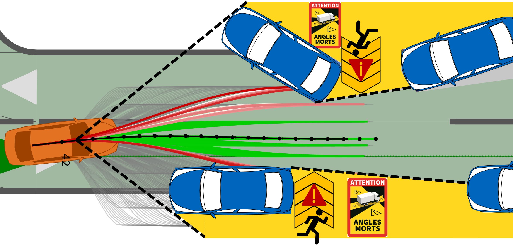

[](https://zenodo.org/records/10078062)

[](https://www.linux.org/)
[](https://www.python.org/downloads/release/python-3100/) [](https://www.python.org/downloads/release/python-390/)


# Frenetix Motion Planner & Multi-agent Scenario Handler

This repository includes a Frenet trajectory planning algorithm and a Multi-agent Simulation Framework in the [CommonRoad](https://commonroad.in.tum.de/) scenario format.
The trajectories are generated according to the sampling-based approach in [1-5] including two different implementations.
The Repo provides a python-based and a C++-accelerated Motion Planner [Frenetix](https://github.com/TUM-AVS/Frenetix/) implementation.
The multi-agent simulation can be used to integrate and test different planning algorithms.


<details>
<summary> <h2> 🔧 Requirements & Pre-installation Steps </h2> </summary>

### Requirements
The software is  developed and tested on recent versions of Linux. We strongly recommend to use [Ubuntu 22.04](https://ubuntu.com/download/desktop) or higher.
For the python installation, we suggest the usage of Virtual Environment with Python 3.10 or Python 3.9
For the development IDE we suggest [PyCharm](http://www.jetbrains.com/pycharm/)

### Pre-installation Steps
1. Make sure that the following **dependencies** are installed on your system for the C++ implementation:
   * [Eigen3](https://eigen.tuxfamily.org/dox/) 
     * On Ubuntu: `sudo apt-get install libeigen3-dev`
   * [Boost](https://www.boost.org/)
     * On Ubuntu: `sudo apt-get install libboost-all-dev`
   * [OpenMP](https://www.openmp.org/) 
     * On Ubuntu: `sudo apt-get install libomp-dev`
   * [python3.10-full](https://packages.ubuntu.com/jammy/python3.10-full) 
        * On Ubuntu: `sudo apt-get install python3.10-full` and `sudo apt-get install python3.10-dev`

2. **Clone** this repository & create a new virtual environment `python3.10 -m venv venv`

3. **Install** the package:
    * Source & Install the package via pip: `source venv/bin/activate` & `pip install .` or `poetry install`
    * [Frenetix](https://pypi.org/project/frenetix/) should be installed automatically. If not please write [rainer.trauth@tum.de](mailto:rainer.trauth@tum.de).

4. **Optional**: Download additional Scenarios [here](https://gitlab.lrz.de/tum-cps/commonroad-scenarios.git)

</details>


<details>
<summary> <h2> 🚀🚀🚀 Frenetix-Motion-Planner Step-by-Step Manual </h2> </summary>

1. Do the **Requirements & Pre-installation Steps**

2. **Change** Configurations in _configurations/_ if needed. 

3. **Change** Settings in **main.py** if needed. Note that not all configuration combinations may work. The following options are available:
   1. **use_cpp**: If _True_: The C++ Frenet Implementations will be used.
   2. Set the scenario name you want to use.

4. **Run** the planner with `python3 main.py`
5. **Logs** and **Plots** can be found in _/logs/<scenario_name>_


</details>


<details>
<summary> <h2> 🚗🛣️🚙 Multi-agent Simulation Framework </h2> </summary>

#### Run Multi-agent Simulation 
1. Do the **Requirements & Pre-installation Steps**
2.  **Change** Configurations in _configurations/_ if needed. \
    By **default**, a multi-agent simulation is started with **all agents**. \
    The multi-agent simulation settings can be adjusted in _configurations/simulation/simulation_. 
3.  **Change** Settings in **main_multiagent.py** if needed
    1. Set the scenario name you want to use.
    3. **evaluation_pipeline**: If _True_: Start an evaluation pipeline with all scenarios
4. **Run** the simulation with `python3 main_multiagent.py`
5. **Logs** and **Plots** can be found in _/logs/<scenario_name>_

    
#### Integration of external Trajectory Planner 
1. A **base class** with all attributes necessary for the simulation is provided in  _cr_scenario_handler/planner_interface_
2. Create a new file with an interface to fit your planner and save it in _cr_scenario_handler/planner_interface_\
    The new **interface** must be a **subclass** of _PlannerInterface_.
3. In _configurations/simulation/simulation_ adjust **used_planner_interface** with the **class-name** of your interface 


</details>

<details>
<summary> <h2> 🚸 Occlusion-aware Module </h2> </summary>





Also checkout the external Occlusion-aware Module [here](https://github.com/TUM-AVS/Frenetix-Occlusion).


</details>


<details>
<summary> <h2> 🤖 Reinforcement Learning Framework </h2> </summary>


Also checkout the external Reinforcement Learning Agent Framework [here](https://github.com/TUM-AVS/Frenetix-RL).


</details>


<details>
<summary> <h2> 📈 Test Data </h2> </summary>

Additional scenarios can be found [here](https://commonroad.in.tum.de/scenarios).

</details>

<details>
<summary> <h2> 🔧 Modules </h2> </summary>

Detailed documentation of the functionality behind the single modules can be found below.

1. [General Planning Algorithm](README.md)

2. [Frenetix C++ Trajectory Handler](https://github.com/TUM-AVS/Frenetix)

3. [Commonroad Scenario Handler](cr_scenario_handler/README.md)

4. [Behavior Planner](behavior_planner/README.md)

5. [Occlusion-aware Module](https://github.com/TUM-AVS/Frenetix-Occlusion)

6. [Wale-Net](https://github.com/TUMFTM/Wale-Net)

7. [Risk-Assessment](https://github.com/TUMFTM/EthicalTrajectoryPlanning)

8. [Reinforcement Learning Module Extension](https://github.com/TUM-AVS/Frenetix-RL)

</details>

<details>
<summary> <h2> 📇 Contact Info </h2> </summary>

[Rainer Trauth](mailto:rainer.trauth@tum.de),
Institute of Automotive Technology,
School of Engineering and Design,
Technical University of Munich,
85748 Garching,
Germany

[Marc Kaufeld](mailto:marc.kaufeld@tum.de),
Professorship Autonomous Vehicle Systems,
School of Engineering and Design,
Technical University of Munich,
85748 Garching,
Germany

[Johannes Betz](mailto:johannes.betz@tum.de),
Professorship Autonomous Vehicle Systems,
School of Engineering and Design,
Technical University of Munich,
85748 Garching,
Germany

</details>

<details>
<summary> <h2> 📃 Citation </h2> </summary>
   
If you use this repository for any academic work, please cite our code:
- [Analytical Planner Paper](https://arxiv.org/abs/2402.01443)

```bibtex
@misc{frenetix2024,
      title={Frenetix Motion Planner: High-Performance and Modular Trajectory Planning Algorithm for Complex Autonomous Driving Scenarios}, 
      author={Korbinian Moller and Rainer Trauth and Gerald Wuersching and Johannes Betz},
      year={2024},
      eprint={2402.01443},
      archivePrefix={arXiv},
      primaryClass={cs.RO}
}
```
- [Multi-agent Simulation Framework](https://arxiv.org/abs/2402.04720)
```bibtex
@misc{multiagent2024,
      title={Investigating Driving Interactions: A Robust Multi-Agent Simulation Framework for Autonomous Vehicles}, 
      author={Marc Kaufeld and Rainer Trauth and Johannes Betz},
      year={2024},
      eprint={2402.04720},
      archivePrefix={arXiv},
      primaryClass={cs.RO}
}
```

</details>