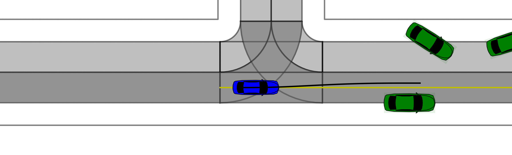
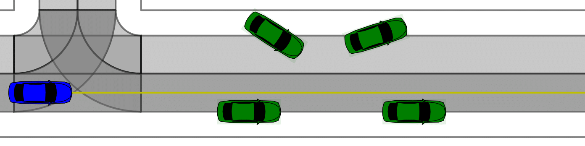
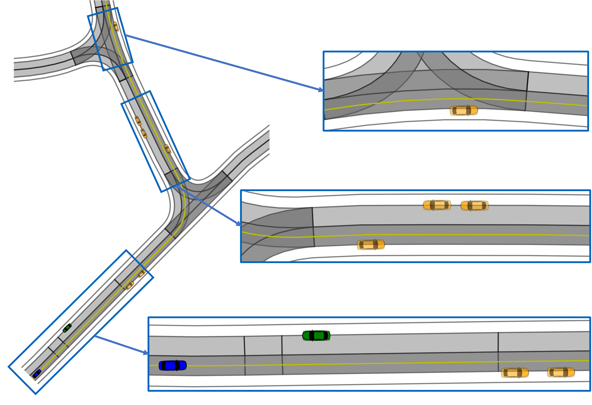
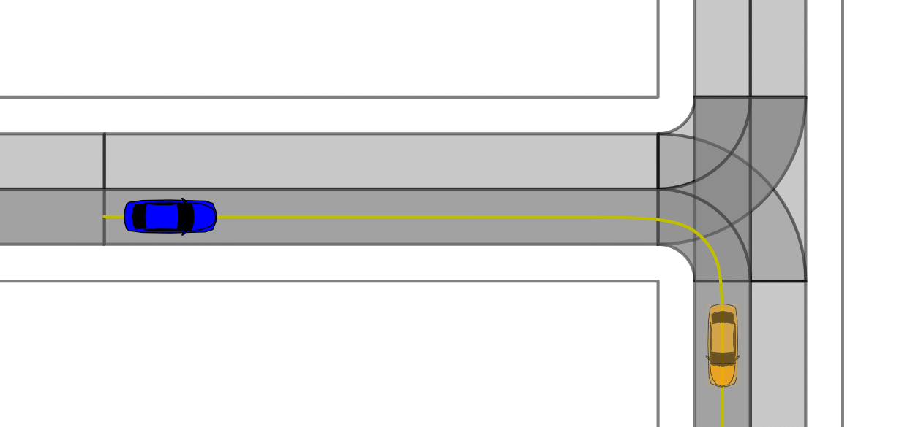
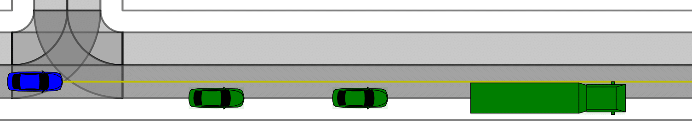

# Occlusion Aware Planning

## Installation

To set everything up, please follow the installation steps [here](https://github.com/TUM-AVS/Frenetix-Motion-Planner/blob/master/README.md) first.

## Overview

This repository contains an implementation of an Occlusion-Aware Trajectory Planning Algorithm. 
The algorithm is designed to plan trajectories for autonomous vehicles in environments where occlusions, e.g. caused by obstacles, are present. 
The goal is to generate collision-free and efficient paths while considering occlusion-awareness to ensure safety and efficiency.

## Scenarios

In the following, four test scenarios are presented, which represent critical traffic situations. Such situations can occur especially in urban environments. 
The scenarios can be used to evaluate the planner. In addition, further general scenarios are available in the CommonRoad database. 

### Available Test-Scenarios
| Scenario                                       | Description                                                                             | Visualization                                                                   |
|------------------------------------------------|-----------------------------------------------------------------------------------------|---------------------------------------------------------------------------------|
| Scenario 1    (configuration available) | Narrow street with parked vehicles on the ego-drive and the opposite side of the drive. |   |
| Scenario 2                                     | Complex scenario with several occluded areas.                                           |   |
| Scenario 3                                     | Turning to the right with a stopped vehicle in front.                                   |   |
| Scenario 4                                     | Narrow street with parked vehicles on the ego-driving side.                             |   |

### Further Scenarios
* Additional [CommonRoad](https://commonroad.in.tum.de/scenarios/) scenarios are available for development and testing purposes.
  * Clone commonroad scenarios on the same level as commonroad-reactive-planner (not into commonroad-reactive-planner)
  * `git clone https://gitlab.lrz.de/tum-cps/commonroad-scenarios.git`
* Create your own scenarios using the [CommonRoad Scenario Designer](https://commonroad.in.tum.de/tools/scenario-designer)

## Run Code and Customize Settings
To use occlusion-aware planning, the following steps must be done:
* all configuration files can be found in `configurations/example/` or `configurations/defaults/`
* It can be quickly switched between these two configurations by adjusting the parameter `dir_config_default='example'` in `main.py`

* activate the Occlusion Module  in `occlusion.yaml`
  * activate the Phantom Module (OPM) (`use_phantom_module: True`) 
  * select whether to create real pedestrians or not - suitable creation locations are stored in the config (`create_real_pedestrians: [x]`)
  * select the maximum accepted harm level (`max_harm: 0.x`) - the planner calculates the possible harm of each trajectory and only considers valid trajectories

  * optional (in `occlusion.yaml`): 
    * activate the Visibility Module (OVE) if desired (`use_visibility_estimator: True`)
    * activate the Uncertainty Map Module (OUME) if desired (`use_uncertainty_map_evaluator: True`)
    * activate different specific plots (OPM, OVE, OUME)
    * activate the final evaluation plot (`evaluate_occ: True`) - will be created after the simulation is finished

* set cost function weights in `cost.yaml`

* further optional settings can be found in other `.yaml` files 

* Plots/outputs will be saved in `/logs/...` --> May be slow due to rendering procedure
  

## Example Configuration
A exemplary configuration is available which can be used for Scenario 1. A Pedestrian is placed in the scenario at the position s=11m. 
If the evaluation of the harm is deactivated, the vehicle drives almost unbraked into the emerging pedestrian. 
The lower the `max_harm` is set, the slower the vehicle approaches.
At e.g. `max_harm: 0.2` no collision will occur and the vehicle can successfully complete the scenario.

(The visualization shows Scenario 1, with `max_harm` set to 0.1 without creating real pedestrians)

